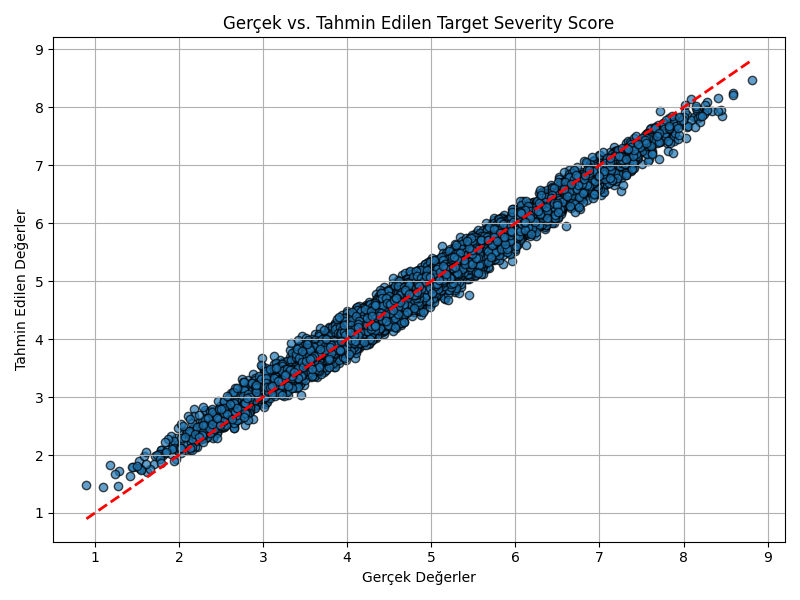

# 🧠 Cancer Severity Scoring Model

This project uses machine learning to **predict the severity score of cancer patients** based on lifestyle, environmental, and clinical features collected between 2015–2024.

---

## 📊 Dataset

- **Source:** [Global Cancer Patients 2015–2024 on Kaggle](https://www.kaggle.com/datasets/zahidmughal2343/global-cancer-patients-2015-2024)
- **Size:** 13,000+ records
- **Target:** `Target_Severity_Score` (0–10 scale)

**Features include:**

- Demographics: `Age`, `Gender`, `Country_Region`
- Lifestyle: `Smoking`, `Alcohol_Use`, `Obesity_Level`
- Environmental: `Air_Pollution`
- Medical: `Genetic_Risk`, `Cancer_Type`, `Cancer_Stage`, `Survival_Years`, `Treatment_Cost_USD`

---

## 🎯 Objective

To train a regression model that predicts the **severity of a cancer case** on a continuous scale, helping healthcare professionals prioritize attention and treatment.

---

## 🧠 Model

- `RandomForestRegressor` from `scikit-learn`
- Tuned using `GridSearchCV`
- Evaluation Metrics:
  - **MAE** (Mean Absolute Error)
  - **RMSE** (Root Mean Squared Error)

---

## 📈 Results



---

## 📦 Project Structure

cancer_severity_model/
│
├── data/
│ └── global_cancer_data.csv
│
├── models/
│ └── severity_model.pkl # Trained model
│
├── Preprocess.py # Data cleaning & encoding
├── Train.py # Model training
├── Predict.py # New prediction logic
│
├── Main.py # End-to-end runner
├── requirements.txt # Python dependencies
└── README.md


---

🚀 How to Run
1. Install dependencies

```bash
pip install -r requirements.txt
```

2. Train the model

```bash
python Train.py
```

This will:

Load and clean the data
Train and tune a RandomForestRegressor
Save the model to models/severity_model.pkl
Plot prediction vs real score graph
3. Predict on new data

Edit the input inside main.py, then run:

```bash
python Main.py
```

Output:

```text
🔮 Predicted severity score: [2.45]
```

📌 Example Input
```python
{
"Age": 60,
"Gender": "Male",
"Country_Region": "Germany",
"Genetic_Risk": 0.6,
"Air_Pollution": 0.4,
"Alcohol_Use": 0.3,
"Smoking": 0.7,
"Obesity_Level": 0.5,
"Cancer_Type": "Lung",
"Cancer_Stage": "Stage IV",
"Treatment_Cost_USD": 30000,
"Survival_Years": 1.2
}
```
✅ Features

📦 Clean preprocessing pipeline
🧠 Scikit-learn regression with hyperparameter tuning
📊 Visual evaluation with real vs predicted scores
💾 Model saved and reused with joblib
📁 Clear project structure and modular code
🔮 Future Plans

 Add batch prediction via CSV input
 Add SHAP-based feature importance
 Turn into REST API (Flask)
 Deploy with Streamlit or Gradio UI
👤 Author

Cem Girgin
Machine Learning Enthusiast • MSc AI @ Universität Passau
